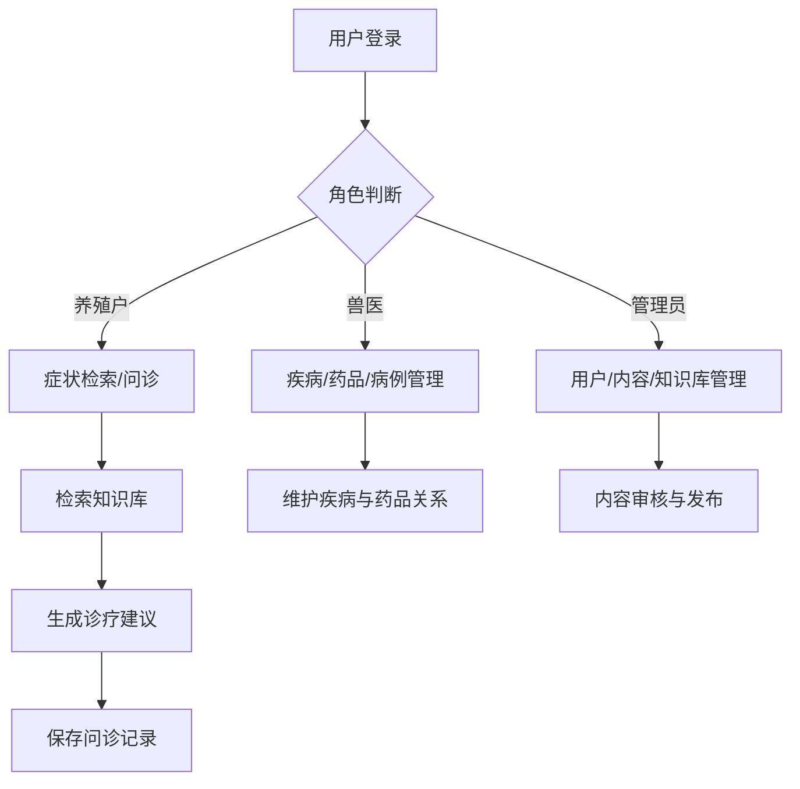
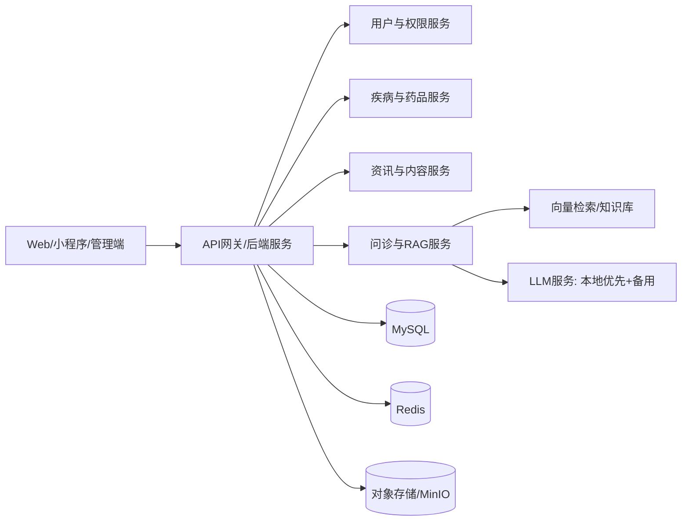
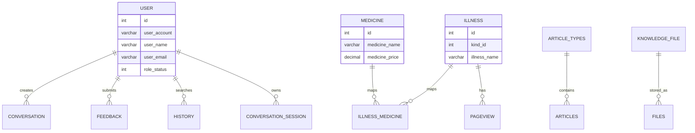

# 产品设计与开发文档

以下为“养猪健康管理综合系统”的完整、结构化、可直接用于开发实施的文档。内容默认采用行业最佳实践配置，并在文末列出需确认事项。

---

# 一、产品设计

## 1. 用户画像

### 1.1 养殖户/场长
- 目标: 快速定位疾病、用药信息、提升猪群健康与成活率
- 行为特征: 移动端使用频繁, 关注操作简单与结果可执行
- 关键诉求: 症状检索、用药建议、资讯学习、历史记录可追溯

### 1.2 兽医/技术员
- 目标: 高效诊断、规范用药、输出可信依据
- 行为特征: 需要更详细的病因、用药禁忌、交互式诊断
- 关键诉求: 知识检索、病例记录、药品与疾病关联查询

### 1.3 管理员/运营
- 目标: 平台内容与数据管理、业务稳定运行
- 行为特征: PC管理端为主, 关注数据统计与内容合规
- 关键诉求: 用户与权限管理、内容审核、知识库维护、日志审计

## 2. 核心功能列表

### 2.1 用户与权限
- 账号注册/登录(密码+邮箱验证码)
- 多角色权限(养殖户/兽医/管理员)
- 个人信息与安全设置

### 2.2 智能诊疗与知识检索
- 症状输入与诊疗建议
- RAG知识库检索 + 诊疗答案引用
- AI模型优先本地, 异常自动切换备用

### 2.3 疾病管理
- 疾病分类、详情、症状与治疗方案
- 疾病与药品关联

### 2.4 药品管理
- 药品CRUD与属性(功效、禁忌、用法用量)
- 药品价格与品牌管理

### 2.5 资讯与文章
- 养殖知识、疾病科普、新闻资讯
- 分类、发布、审核、展示

### 2.6 文件与反馈
- 文件上传与统一管理
- 用户反馈提交与处理

### 2.7 RAG知识库
- 文档上传(多格式白名单)
- 去重、索引、查询与删除
- 可配置存储目录

## 3. 用户操作流程图(Mermaid)

## 4. 关键界面交互说明

### 4.1 智能问诊页
- 输入框支持自然语言症状描述
- 提交后展示: 检索依据 + 诊疗结论 + 推荐药品
- 异常时提示"备用模型已启用", 保证可用性

### 4.2 疾病详情页
- 信息模块化: 症状、病因、治疗方案、相关药品
- 与药品关联可跳转至药品详情

### 4.3 药品详情页
- 分区展示: 功效、禁忌、相互作用、用法用量
- 价格与品牌来源展示

### 4.4 管理端知识库
- 上传支持多格式, 展示解析状态
- 支持备注、筛选、批量删除
- 删除时提示"同步删除磁盘文件"

---

# 二、技术架构

## 1. 系统架构图(Mermaid)

## 2. 技术栈选型与理由

### 2.1 前端
- Vue3 + Vite + Pinia
  理由: 生态成熟、开发效率高、适合多端响应式与组件复用。
- 小程序框架(uni-app)
  理由: 一次开发多端部署, 降低维护成本。

### 2.2 后端
- Spring Boot 3 + Spring AI + MyBatis Plus
  理由: 稳定、生态完备、易于快速构建企业级业务与AI集成。
- Sa-Token
  理由: 轻量、可扩展、适合多角色权限管理。

### 2.3 数据库与缓存
- MySQL 8
  理由: 事务能力强、成本低、运维成熟, 适合结构化数据。
- Redis
  理由: 加速热点数据、会话与验证码场景。

### 2.4 AI与向量检索
- Ollama(本地优先) + DeepSeek(备用)
  理由: 本地模型可控且成本低, 备用保证稳定性与可用性。
- VectorStore
  理由: 支持知识库检索增强, 保证回答可追溯。

### 2.5 云服务与存储
- MinIO
  理由: 兼容S3协议、部署灵活、成本低, 适合文件管理。

## 3. 模块划分与职责
- 用户与权限模块: 认证、角色、权限控制
- 问诊与RAG模块: 模型调用、检索、结果拼接
- 疾病管理模块: 疾病分类、详情、关联
- 药品管理模块: 药品数据与价格维护
- 资讯模块: 文章分类、发布、审核
- 文件管理模块: 上传、元数据、存储
- 运营与日志模块: 统计与审计

---

# 三、开发实施

## 1. 数据库ER图(Mermaid)

## 2. 核心API端点定义(REST)

### 2.1 用户与权限
- POST /api/auth/login
  理由: 标准登录入口, 统一鉴权流程
- POST /api/auth/register
  理由: 支持平台自注册
- GET /api/user/profile
  理由: 个人信息读取

### 2.2 智能问诊
- POST /api/ai/consult
  入参: 症状描述、用户ID
  出参: 诊疗建议、引用资料、推荐药品
  理由: 核心AI能力统一入口
- GET /api/ai/history
  理由: 问诊记录可追溯

### 2.3 疾病与药品
- GET /api/illness
- GET /api/illness/{id}
- GET /api/medicine
- GET /api/medicine/{id}
  理由: 标准化查询接口, 利于多端复用
- POST /api/illness-medicine
  理由: 维护关联关系

### 2.4 资讯与文章
- GET /api/articles
- GET /api/articles/{id}
- POST /api/admin/articles
  理由: 读写分离, 便于权限控制

### 2.5 知识库
- POST /api/knowledge/upload
- GET /api/knowledge/list
- DELETE /api/knowledge/{id}
  理由: 支持RAG数据维护与审计

## 3. 环境配置清单
- JDK 21
- Node.js 16+
- MySQL 8.0
- Redis 6+
- MinIO 8+
- Ollama/DeepSeek 服务
理由: 与现有技术栈一致, 避免兼容性风险。

## 4. 部署与CI/CD建议

### 4.1 部署建议
- 后端: Docker容器化部署, 独立配置数据库与Redis
- 前端: 静态资源部署至Nginx
- 小程序: 发布至微信/支付宝平台

理由: 降低环境差异与部署成本, 便于扩展。

### 4.2 CI/CD流程
- 代码提交触发单元测试
- 构建镜像并推送镜像仓库
- 自动化部署到测试/生产
理由: 减少人工发布风险, 保证版本可追溯。

---

# 四、待明确事项
- AI诊疗结果需要强制展示免责声明。
- 是否需要多租户支持: 不需要。
- 是否对接真实药品供应链系统: 不需要。
- 知识库更新方式: 定时更新。
- 是否需要离线模式或弱网支持: 不需要。

---

# 五、补充说明

## 1. 作品简介(200字)
本作品面向养猪健康管理场景, 提供管理端、Web端与小程序多端协同能力, 覆盖疾病检索、用药信息、养殖资讯与AI问诊等核心流程。系统以Spring Boot与Vue为基础, 后端负责用户权限、疾病与药品管理、资讯内容与知识库维护, 前端提供面向养殖户与兽医的高效交互入口。AI问诊采用检索增强生成思路, 先检索本地知识库, 再结合模型输出可追溯的诊疗建议, 并在本地模型异常时自动切换备用线路以保证可用性。整体强调数据结构化沉淀、知识可维护、业务可扩展, 适配养殖场日常诊疗与用药管理的实际需求。

## 2. 开源代码及组件说明
本项目未声明引入第三方开源代码片段的二次分发, 主要依赖已在项目说明中列出的开源框架与组件(如Spring Boot、Vue、MyBatis Plus、Sa-Token、Redis、MinIO等)。

## 3. 作品安装说明
1) 环境准备
- JDK 21
- MySQL 8.0
- Redis 6+
- Node.js 16+
- Maven 3.8+
- Ollama/DeepSeek 服务(用于AI问诊)

2) 数据库初始化
- 执行SQL脚本创建数据库: `SQL/pig_health_smart_medicine.sql`
- 配置后端 `application.yml` 中的数据库连接

3) 后端启动
- 进入 `backend` 目录
- 执行 `mvn clean package`
- 执行 `java -jar target/pig-health-smart-medicine.jar`

4) 前端启动
- 管理端: 进入 `frontend/admin`, 执行 `npm install` 与 `npm run dev`
- Web端: 进入 `frontend/web`, 执行 `npm install` 与 `npm run dev`
- 小程序: 进入 `miniapp`, 使用HBuilderX或对应工具运行

## 4. 作品效果图
以下为项目内已包含的运行截图(路径来自仓库内 `doc/img` 目录):
- 小程序: `doc/img/uniapp/pig34.png` 等
- Web管理端: `doc/img/web_admin/pig19.png` 等
- Web用户端: `doc/img/web_user/pig1.png` 等

## 5. 设计思路
- 以养殖场景为核心, 将疾病、药品、问诊与资讯形成闭环, 让“发现问题-诊断建议-用药参考-知识学习”可在同一系统完成。
- 采用前后端分离与多端适配, 管理端负责数据与内容维护, 用户端强调高频查询与轻量交互。
- AI问诊引入RAG机制, 通过知识库检索提供可追溯依据, 避免纯模型幻觉。
- 数据层面沉淀结构化实体, 便于后续统计分析与扩展。

## 6. 设计重点难点
- 知识库与模型协同: 需要保证检索结果的相关性与可读性, 同时兼顾响应速度与稳定性。
- 数据一致性与权限: 多角色并行使用时, 需要保证权限边界清晰, 避免误操作。
- 多端体验一致: 管理端与用户端关注点不同, 需要在信息密度与操作效率之间平衡。
